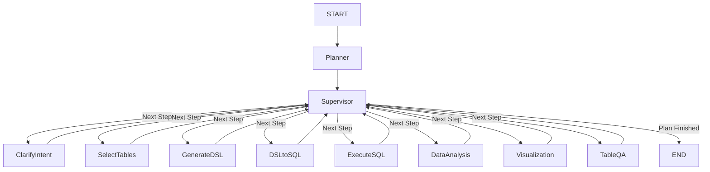

# Text2SQL Agent Project

## 📖 项目简介
本项目是一个企业级的高级 Text2SQL 智能体系统，旨在通过自然语言与数据库进行交互。与传统的 Text2SQL 不同，本项目采用了 **LangGraph** 驱动的 **Planner-Supervisor-Worker** 架构，能够处理复杂的查询任务，并提供数据分析和可视化报表。

## 🌟 核心特性
- **动态规划 (Dynamic Planning)**: 不仅仅是翻译 SQL，而是先生成执行计划（如：查表 -> 生成 DSL -> 转 SQL -> 执行 -> 分析 -> 绘图），从容应对复杂业务场景。
- **DSL 中间层**: 引入 JSON 格式的 DSL (Domain Specific Language) 作为中间表示，解耦自然语言与 SQL，提高准确率和稳定性。
- **智能 Schema 选择**: 使用 RAG 技术根据问题动态检索相关表结构，支持大规模数据库（1000+ 表）。
- **自动化数据分析**: 执行 SQL 后，自动对数据结果进行业务解读和洞察。
- **智能可视化**: 根据数据特征自动推荐并生成最合适的 ECharts 图表。
- **全流程流式响应**: 前后端通过 SSE (Server-Sent Events) 实时同步思考过程、执行步骤和最终结果。

## 🏗️ 系统架构

### 架构模式：Planner-Supervisor-Worker
本项目基于 LangGraph 构建了一个有向无环图（DAG）工作流。



### 核心模块说明
| 模块 (Agent) | 职责 | 源码位置 |
| :--- | :--- | :--- |
| **Planner** | **战略家**。分析用户意图，生成分步执行计划。 | [`src/agents/planner.py`](src/agents/planner.py) |
| **Supervisor** | **调度员**。维护执行进度，按计划路由到下一个 Worker。 | [`src/agents/supervisor.py`](src/agents/supervisor.py) |
| **ClarifyIntent**| **交互员**。识别意图是否清晰，必要时反问用户。 | [`src/agents/clarify.py`](src/agents/clarify.py) |
| **SelectTables** | **图书管理员**。基于向量检索 (RAG) 查找相关表结构。 | [`src/agents/select_tables.py`](src/agents/select_tables.py) |
| **GenerateDSL** | **翻译官**。将自然语言转换为中间 DSL 结构。 | [`src/agents/gen_dsl.py`](src/agents/gen_dsl.py) |
| **DSLtoSQL** | **DBA**。将 DSL 编译为可执行的 SQL 语句。 | [`src/agents/dsl2sql.py`](src/agents/dsl2sql.py) |
| **ExecuteSQL** | **执行者**。执行 SQL 并获取结果，具备错误重试机制。 | [`src/agents/execute.py`](src/agents/execute.py) |
| **DataAnalysis** | **分析师**。对查询结果进行业务侧的 Markdown 分析。 | [`src/agents/analysis.py`](src/agents/analysis.py) |
| **Visualization**| **设计师**。生成 ECharts 可视化配置。 | [`src/agents/visualization.py`](src/agents/visualization.py) |

## 🛠️ 技术栈
- **Backend**: Python 3.13+, FastAPI, LangChain, LangGraph, SQLAlchemy, Pydantic
- **Frontend**: React 19, TypeScript, Vite, Ant Design, ECharts
- **Database**: MySQL (业务数据), ChromaDB (向量索引), Redis (状态缓存)
- **Tooling**: `uv` (Python 包管理), `npm`

## 🚀 快速启动

### 1. 环境准备
确保已安装 Python 3.13+ 和 Node.js。

### 2. 启动后端
```bash
# 安装依赖
uv sync

# 启动服务 (默认端口 8000)
uv run uvicorn src.server:app --reload
```

### 3. 启动前端
```bash
cd frontend

# 安装依赖
npm install

# 启动开发服务器
npm run dev
```

访问 `http://localhost:5173` 即可开始使用。

## 📂 目录结构
```
.
├── frontend/           # React 前端项目
├── src/
│   ├── agents/         # 各类 Agent 实现
│   ├── state/          # LangGraph 状态定义
│   ├── utils/          # 数据库、LLM 等工具类
│   ├── graph.py        # LangGraph 图构建与编译
│   ├── server.py       # FastAPI 服务入口
│   └── main.py         # CLI 入口 (可选)
├── pyproject.toml      # Python 项目配置
└── README.md           # 项目文档
```
