# Enterprise Text2SQL Agent

[](https://www.python.org/)
[](https://fastapi.tiangolo.com/)
[](https://react.dev/)
[](https://langchain-ai.github.io/langgraph/)
[](https://www.docker.com/)
[](LICENSE)

本项目是一个企业级的高级 Text2SQL 智能体系统，旨在通过自然语言与数据库进行交互。采用 **LangGraph** 驱动的 **Swarm** (DataDetective + Planner + Workers) 架构，集成了 **主动洞察**、**生成式 UI**、**自愈 Schema**、**隐私计算** 和 **RLHF-lite 反馈学习** 等下一代特性。

## 🏗️ 系统架构 (System Architecture)

系统采用分层微服务架构，以 **LangGraph Swarm** 为核心编排引擎，向下连接多源异构数据库，向上通过 **SSE (Server-Sent Events)** 提供实时流式交互。





### 🧩 核心模块职责

1.  **👨‍✈️ Supervisor (总控节点)**: 整个 Swarm 架构的大脑，负责理解用户意图，维护执行状态，并动态调度下游 Worker。它决定了是先进行数据探查 (`Detective`)，还是直接生成 SQL (`SQLEngineer`)，或者是生成可视化报表 (`Artist`)。
2.  **🕵️‍♂️ Data Detective (数据侦探)**: 在生成 SQL 之前，通过统计抽样和模式分析，对数据分布进行“验尸”，为 SQL 生成提供先验知识，大幅降低幻觉。
3.  **🛠️ SQL Engineer (SQL 工程师)**: 基于 RAG 检索到的 Schema 和侦探提供的上下文，编写高准确率的 SQL。支持多方言 (PostgreSQL, MySQL)。
4.  **📦 Python Sandbox (安全沙箱)**: 一个隔离的 Python 执行环境，用于运行复杂的数据清洗、统计分析 (Pandas) 和绘图 (Matplotlib) 代码。严控 `import` 和文件操作，确保安全。
5.  **🛡️ Privacy Filter (隐私守门员)**: 在数据离开数据库层之前，自动识别并脱敏敏感字段 (如 PII 信息)，确保传回给 LLM 和前端的数据是合规的。

## 🌟 核心特性 (Key Features)

### 1. 🧠 深度智能 V2.0
- **Swarm 协作架构**: 引入 `DataDetective` 角色进行先验假设分析，`InsightMiner` 主动挖掘数据价值，配合 `Planner` 和 `Supervisor` 实现复杂任务拆解。
- **主动洞察 (Active Insight)**: 系统不仅回答问题，还会主动发现数据中的异常值、趋势和反直觉现象。
- **自愈 Schema (Self-Healing)**: 当数据库字段变更导致 SQL 错误时，自动探测最新 Schema 并自我修复，无需人工干预。

### 2. 🎨 生成式体验 (Generative UX)
- **UI Artist**: 根据数据和洞察，动态生成 React 组件代码 (KPI 卡片、Dashboard 布局)，实现“千人千面”的界面展示。
- **流式响应**: 实时推送侦探思考 (`detective_insight`)、执行计划 (`plan`)、Python 代码 (`code_generated`) 和最终 UI (`ui_generated`)。

### 3. 🛡️ 企业级安全与运维
- **隐私计算层 (Privacy Layer)**: 自动识别并掩码敏感字段 (如手机号、薪资)，确保数据安全。
- **SQL 防护墙**: 严格的 AST 语法树检查，拦截 DDL/DML 操作。
- **RLHF-lite**: 基于用户反馈 (👍/👎) 的强化学习机制，自动优化 Few-Shot 样本库和语义缓存。
- **自动化评估**: 内置回归测试框架 (`src/eval`), 确保能力不退化。

## 🚀 快速启动

### 方式一: Docker 一键启动 (推荐)
无需安装 Python/Node.js 环境，仅需 Docker。

```bash
# 1. 克隆项目
git clone ...

# 2. 配置环境变量
cp .env.example .env
# 编辑 .env 填入 OpenAI Key

# 3. 启动所有服务 (Backend, Frontend, Postgres, Redis)
docker-compose up -d

# 4. 访问
# 前端: http://localhost
# API 文档: http://localhost:8000/docs
```

### 方式二: 本地开发启动

#### 1. 环境准备
确保已安装 Python 3.11+ 和 Node.js 18+。
推荐使用 `uv` 进行 Python 包管理。

#### 2. 后端启动
```bash
# 安装依赖
uv sync

# 启动 API 服务
uv run uvicorn src.api.app:app --host 0.0.0.0 --port 8000 --reload
```

#### 3. 前端启动
```bash
cd frontend
npm install
npm run dev
```
访问 `http://localhost:5173` 即可。

## 📂 目录结构
```
.
├── docker/             # Docker 构建文件
├── docker-compose.yml  # 容器编排
├── frontend/           # React 前端项目
├── src/
│   ├── api/            # FastAPI 路由 (Chat, Feedback, Audit...)
│   ├── core/           # 核心基础 (DB, LLM, Config, Security)
│   ├── domain/         # 领域逻辑 (Memory, Sandbox, Schema Search)
│   ├── workflow/       # LangGraph 工作流 (Nodes, Graph, State)
│   │   ├── nodes/      # 智能节点 (Detective, Planner, Artist...)
│   └── eval/           # 自动化评估框架
└── pyproject.toml      # 依赖配置
```

## ⚙️ 环境变量配置 (.env)

```ini
# --- 模型配置 ---
OPENAI_API_KEY=sk-...
OPENAI_MODEL_NAME=gpt-4o

# --- 数据库配置 ---
# 业务数据 (默认查询目标)
POSTGRES_USER=admin
POSTGRES_PASSWORD=admin
POSTGRES_DB=text2sql

# --- 缓存配置 ---
REDIS_URL=redis://localhost:6379/0
```

## 🧪 测试与评估

```bash
# 运行单元测试
uv run pytest

# 运行 Text2SQL 准确率评估 (Regression Test)
uv run src/eval/run.py --limit 10 --parallel 5
```
